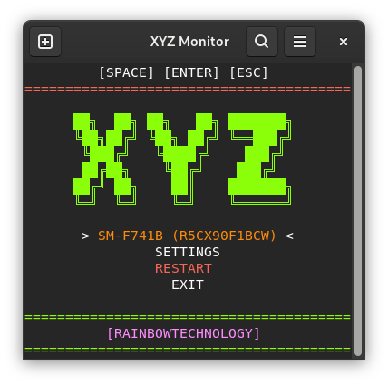

# XYZ-scrcpy

Interactive Android device launcher and monitor on top of `scrcpy`, built for users who want an auto-start background service plus a configurable terminal UI.

<p align="center">
  
</p>
<p align="center"><em>Current app appearance (real usage screenshot)</em></p>

## Who This Is For

- Linux desktop users who connect Android devices frequently.
- Users who want a background monitor service with popup control.
- Users who need a custom command alias and quick recovery flow.

## Requirements

- `python3`
- `adb`
- `scrcpy`
- `bash`
- Linux desktop with `systemd --user` and any common terminal emulator for full auto-start UX
- macOS (Terminal app fallback via AppleScript)
- Windows (best-effort monitor popup via PowerShell terminal fallback)
- Bundled upstream `scrcpy` in `vendor/` is aligned to latest stable tag `v3.3.4` and is preferred at runtime (fallback: system `scrcpy` in `PATH`)

## Architecture and Flows (SVG)


*Main components and interactions.*


*Clean-install and post-install decision flow.*


*Launcher runtime states, including fail-open confirmation.*

## Install and Run

1. Clone repository:
   ```bash
   git clone https://github.com/xyz-rainbow/xyz-scrcpy.git
   cd xyz-scrcpy
   ```

2. Run installer:
   ```bash
   python3 install_xyz.py
   ```

3. Installer interactive flow:
   - Clean install (full uninstall first).
   - Prompt: `Enable service (Y/n)`.
   - Prompt: `Run tests and view log (Y/n)`.
   - Initial mini terminal launch at the end.
   - Fail-open confirmation if checks still fail after repair.

4. Launch command:
   - Use the alias you selected during install.
   - Default alias is typically `xyz-scrcpy` unless changed.

### Non-interactive examples

```bash
# Install with defaults
python3 install_xyz.py --action install --yes

# Install with custom alias
python3 install_xyz.py --action install --alias scrcpy --yes

# Full uninstall
python3 install_xyz.py --action uninstall --yes
```

## Current App Features

### Interactive terminal UI

- Dynamic centered menu that redraws with terminal width changes.
- Arrow-key navigation (`UP/DOWN`) with `ENTER` to select.
- Keyboard shortcuts shown in UI: `[SPACE] [ENTER] [ESC]`.
- Live Android device list from `adb devices`.
- Device labels include model and serial (`Model (serial)`).
- `SETTINGS` and `EXIT` entries always available.

### Device launch behavior

- Launches `scrcpy` for selected device with software render driver (`--render-driver=software`).
- Audio mode is configurable as:
  - `output` (host audio enabled), or
  - `off` (launches with `--no-audio`).
- Menu lock prevents duplicate concurrent menu sessions (`/tmp/xyz_menu.lock`).

### Settings currently implemented

- `Command alias`:
  - Editable inside settings.
  - Sanitized to safe command characters.
  - Synced automatically via installer `sync-alias` flow.
- `Audio target`: `HOST` / `DEVICE`.
- `Active Recall`: `ON` / `OFF` (captures microphone directly from Android via scrcpy when supported).
- `Microphone Bus`: `ON` / `OFF` (creates virtual input `xyz-mic-input`; Linux auto-setup via `pactl` without adding a dedicated extra output sink, Windows requires external virtual cable setup).
- `Auto-start`: enables/disables monitor auto-launch behavior.
- `Auto-Discover`: controls automatic reaction to device connection events.
- `Pause on EXIT`: toggle between paused and immediate-start behavior.
- `Pause duration (minutes)`: minimum 1 minute, adjustable in settings.
- `[Apply]` and `[Cancel]` actions in settings.
- `RESTART` action in main menu to re-apply current audio/microphone settings to active scrcpy flow.

### Audio and microphone rules

- `active_recall=ON` means Android microphone capture path (not host microphone capture).
- Android microphone capture is attempted with scrcpy microphone flag support (`--audio-source=mic`).
- If `active_recall=ON` and `audio_target=DEVICE`, config is normalized to `audio_target=HOST` for compatibility.
- If current scrcpy version does not support Android microphone capture, app falls back safely with warning (no crash).
- With `microphone_bus=ON`, app prioritizes virtual bus routing through `xyz-mic-input`.
  - Linux: creates a remapped source from the current default sink monitor (no dedicated extra virtual output sink), reuses existing `xyz-mic-input` if present, and avoids duplicate module/source creation.
  - macOS: detects existing `xyz-mic-input`; otherwise shows guided setup (virtual loopback driver such as BlackHole).
  - Windows: detects existing `xyz-mic-input`; otherwise shows guided setup (virtual cable such as VB-CABLE).

### Pause and reconnect contract

- When `Pause on EXIT` is enabled and user exits menu, monitor enters paused state.
- Pause stores:
  - `pause_active`,
  - `pause_wait_reconnect`,
  - `pause_seen_disconnect`,
  - `pause_until_epoch`.
- With `Auto-Discover = ON`, pause can be lifted by valid reconnect conditions:
  - a previously disconnected device reconnects, or
  - device serial set changes and at least one device is present.
- Pause is also lifted automatically when pause timeout is reached.
- With `Auto-Discover = OFF`, reconnect does not auto-resume the monitor loop.

### Background monitor service behavior

- Monitor loop runs in `bin/monitor.sh`.
- PID lock avoids multiple monitor instances (`/tmp/xyz_monitor.pid`).
- Tracks previous/current device serial snapshots (`/tmp/xyz_monitor_serials.state`).
- Performs Python syntax validation (`menu.py` + `config_loader.py`) before opening terminal.
- Popup anti-spam protection:
  - does not open extra monitor terminal if one is already active,
  - does not open popup if any `scrcpy` process is already active.
- Terminal geometry policy:
  - base geometry includes extra height to avoid clipped header,
  - adds one extra row per additional connected device.

### Pre-launch checks and fail-open flow

- Alias launcher executes `bin/launch_with_checks.sh`.
- Launcher runs `bin/check_and_repair.sh` unless installer already pre-ran checks.
- Checks include:
  - quick path on alias launch: syntax checks only (Python + shell scripts),
  - full unit test suite in background to avoid blocking startup.
- Timeouts protect all major check/repair commands.
- If checks fail:
  - automatic repair is executed (`repair_xyz.sh`),
  - checks are re-run.
- Auto-repair logs include start/end markers, elapsed time, and exit code.
- If still failing:
  - status becomes `FAIL_OPEN`,
  - optional prompt to open a prefilled GitHub issue page in the browser,
  - user is prompted `Open menu anyway despite errors? (Y/n)`.
- `config/check.log` is generated and includes GitHub Issues reporting guidance.
- `config/check.log` includes time log entries (start/end/elapsed seconds) for each check run.
- `config/full-check.log` stores background full-suite results.
- If GitHub issue creation is not possible (requires login), logs can be sent by email to `rainbow@rainbowtechnology.xyz`.

### Installer and uninstaller capabilities

- Multi-OS support path logic for Linux, macOS, and Windows.
- Semi-interactive startup with:
  - `Install now (Y/n)`,
  - confirmation prompt,
  - custom launcher alias prompt.
- Install flow supports:
  - clean install (calls uninstall first),
  - optional service enable (`Enable service (Y/n)`),
  - optional test/check run with log display,
  - opening initial mini terminal after install.
- Uninstall flow includes:
  - service/task stop first,
  - startup disable/removal second,
  - launcher cleanup (primary + managed orphan launchers),
  - optional installed files removal,
  - optional current repository removal with safety checks.
- `sync-alias` action updates stored alias and launcher script without reinstall.

## Runtime Behavior

- Manual alias launch remains available regardless of monitor auto behavior.
- Service mode uses monitor conditions to avoid terminal popup spam.
- Interactive menu is always opened through pre-check gate when launched via alias.

## Repository Layout

- `install_xyz.py` — multi-OS installer and uninstaller.
- `bin/menu.py` — interactive terminal UI.
- `bin/monitor.sh` — background monitor loop.
- `bin/launch_with_checks.sh` — launcher with pre-check gate.
- `bin/check_and_repair.sh` — checks + repair + fail-open status.
- `bin/config_loader.py` — config defaults and persistence.
- `tests/` — installer, monitor, and shell flow tests.
- `systemd/scrcpy-auto.service` — service template/reference.
- `config/` — runtime config and logs.
- `docs/audio-mic-restart-risks-walkthrough.md` — risks and operational walkthrough for audio/mic/restart behavior.

## Feature to File Map

| Feature | Main file/script | Notes |
|---|---|---|
| Interactive menu rendering and navigation | `bin/menu.py` | Dynamic width, centered layout, key handling |
| Device discovery and labels | `bin/menu.py` | Uses `adb devices` + model lookup |
| Device launch with audio target | `bin/menu.py` | Starts `scrcpy` with `--no-audio` when target is `DEVICE` |
| Microphone forwarding capability check | `bin/menu.py` | Adds mic flag only when detected as supported by current `scrcpy` |
| scrcpy binary resolution | `bin/menu.py` | Uses `vendor/scrcpy` when executable, else falls back to `scrcpy` from `PATH` |
| Virtual microphone bus (`xyz-mic-input`) | `bin/menu.py` | Linux auto-setup via `pactl` with duplicate-safe reuse, plus macOS/Windows existing-device detection and guided fallback |
| Settings editing (`Apply`/`Cancel`) | `bin/menu.py` | Includes alias, audio/mic, auto flags, and pause options |
| Restart-to-apply audio/mic settings | `bin/menu.py` | `RESTART` button highlights when pending changes exist |
| Pause activation on exit | `bin/menu.py` | Persists pause state/timer in config |
| Config defaults and normalization | `bin/config_loader.py` | Backward compatibility and type coercion |
| Config persistence (`config.json`) | `bin/config_loader.py` | Atomic save via temp file replace |
| Auto monitor loop | `bin/monitor.sh` | Polls devices and decides popup launch with Linux/macOS/Windows terminal fallbacks |
| Popup anti-spam guard | `bin/monitor.sh` | Detects active monitor terminal or `scrcpy` process |
| Reconnect-aware pause resume | `bin/monitor.sh` | Uses serial snapshots and pause flags |
| Pre-launch check gate | `bin/launch_with_checks.sh` | Runs checks, handles fail-open prompt |
| Checks + auto-repair pipeline | `bin/check_and_repair.sh` | Syntax/tests, repair retry, check log |
| Installer interactive flow | `install_xyz.py` | Install/uninstall/sync-alias, prompts and cleanup |
| Service install/enable/disable/stop | `install_xyz.py` | OS-specific handling (Linux/macOS/Windows) |
| Alias creation and synchronization | `install_xyz.py` | Launcher generation + managed launcher cleanup |
| Runtime logs and diagnostics | `config/check.log`, `config/scrcpy.log` | Check pipeline and service output |
| Unit/integration behavior coverage | `tests/` | Installer, monitor, launcher/check shell flows |

## Validation

```bash
python3 -m py_compile install_xyz.py bin/menu.py bin/config_loader.py
bash -n bin/monitor.sh
bash -n bin/check_and_repair.sh
bash -n bin/launch_with_checks.sh
python3 -m unittest discover -s tests -p "test_*.py"
```

## Operations

```bash
# Restart service
systemctl --user restart scrcpy-auto.service

# Check service status
systemctl --user status scrcpy-auto.service --no-pager -n 20

# Manual repair workflow
./repair_xyz.sh
```

## Past Visual Versions

These screenshots are kept as legacy visual references from earlier UI iterations:

<table>
  <tr>
    <td align="center">
      
      <br />
      <em>Legacy former top screenshot</em>
    </td>
    <td align="center">
      
      <br />
      <em>Legacy terminal view</em>
    </td>
  </tr>
  <tr>
    <td align="center">
      
      <br />
      <em>Legacy monitor view</em>
    </td>
    <td align="center">
      
      <br />
      <em>Legacy branding preview</em>
    </td>
  </tr>
</table>

## Credits

Developed by xyz-rainbow / Rainbowtechnology [XYZ]  
GitHub https://github.com/xyz-rainbow

#xyz-rainbowtechnology #i-love-you #xyz-rainbow
