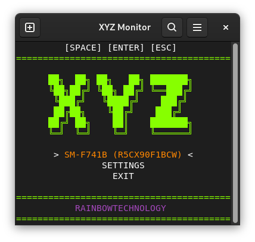
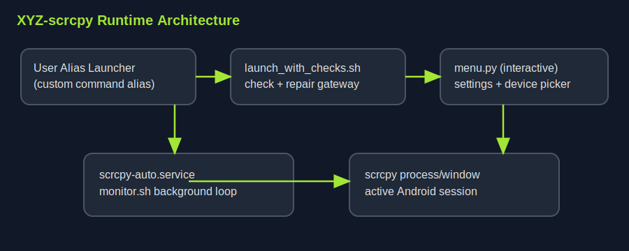
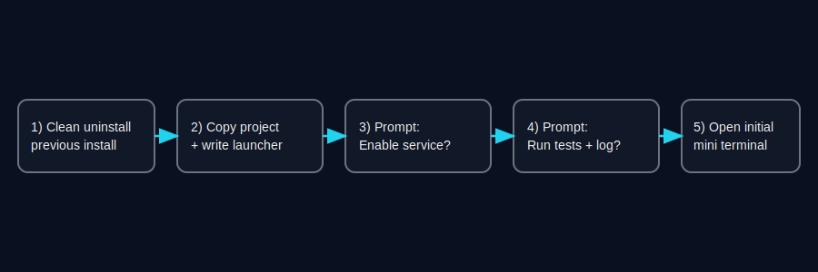
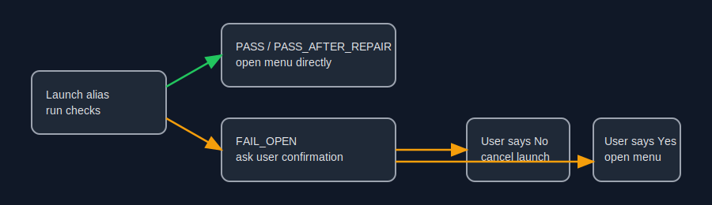
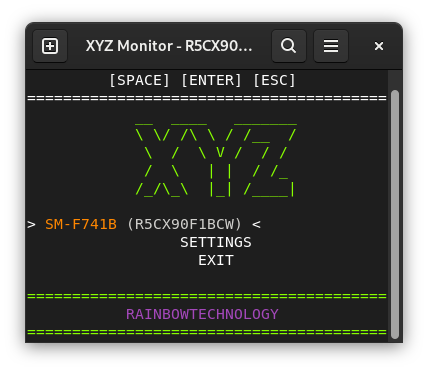
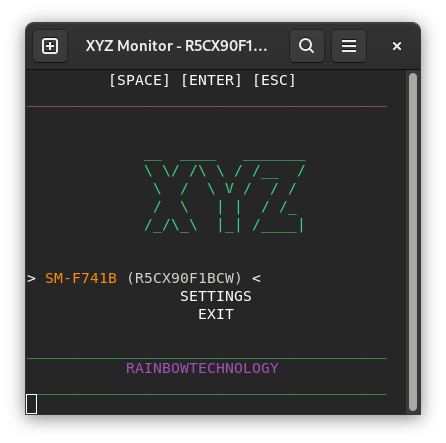
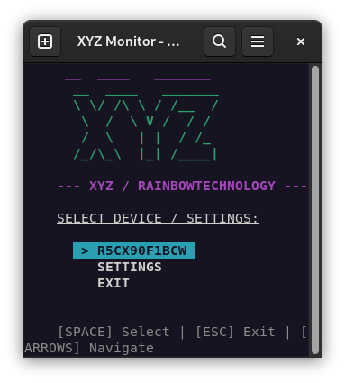

# XYZ-scrcpy

Interactive Android device launcher and monitor on top of `scrcpy`, built for users who want an auto-start background service plus a configurable terminal UI.

<p align="center">
  
</p>
<p align="center"><em>Current app appearance (real usage screenshot)</em></p>

## Who This Is For

- Linux desktop users who connect Android devices frequently.
- Users who want a background monitor service with popup control.
- Users who need a custom command alias and quick recovery flow.

## Requirements

- `python3`
- `adb`
- `scrcpy`
- `bash`
- Linux desktop with `systemd --user` and `gnome-terminal` for full auto-start UX

## Architecture and Flows (SVG)


*Main components and interactions.*


*Clean-install and post-install decision flow.*


*Launcher runtime states, including fail-open confirmation.*

## Install and Run

1. Clone repository:
   ```bash
   git clone https://github.com/xyz-rainbow/xyz-scrcpy.git
   cd xyz-scrcpy
   ```

2. Run installer:
   ```bash
   python3 install_xyz.py
   ```

3. Installer interactive flow:
   - Clean install (full uninstall first).
   - Prompt: `Enable service (Y/n)`.
   - Prompt: `Run tests and view log (Y/n)`.
   - Initial mini terminal launch at the end.

4. Launch command:
   - Use the alias you selected during install.
   - Default alias is typically `xyz-scrcpy` unless changed.

### Non-interactive examples

```bash
# Install with defaults
python3 install_xyz.py --action install --yes

# Install with custom alias
python3 install_xyz.py --action install --alias scrcpy --yes

# Full uninstall
python3 install_xyz.py --action uninstall --yes
```

## Runtime Behavior

- Alias launcher executes `bin/launch_with_checks.sh`.
- Checks are run through `bin/check_and_repair.sh` with timeout protection.
- If checks fail, repair runs automatically, then checks rerun.
- If still failing, the launcher asks:
  - `Open menu anyway despite errors? (Y/n)`
- Logs include guidance to report failures in GitHub Issues.

## Settings

From in-app `SETTINGS` you can configure:
- Command alias
- Sound mode
- Auto-start behavior
- Pause-on-exit behavior and duration (minutes)

Applying alias changes syncs the launcher automatically via installer sync logic.

## Repository Layout

- `install_xyz.py` — multi-OS installer and uninstaller.
- `bin/menu.py` — interactive terminal UI.
- `bin/monitor.sh` — background monitor loop.
- `bin/launch_with_checks.sh` — launcher with pre-check gate.
- `bin/check_and_repair.sh` — checks + repair + fail-open status.
- `bin/config_loader.py` — config defaults and persistence.
- `tests/` — installer, monitor, and shell flow tests.
- `systemd/scrcpy-auto.service` — service template/reference.
- `config/` — runtime config and logs.

## Validation

```bash
python3 -m py_compile install_xyz.py bin/menu.py bin/config_loader.py
bash -n bin/monitor.sh
bash -n bin/check_and_repair.sh
bash -n bin/launch_with_checks.sh
python3 -m unittest discover -s tests -p "test_*.py"
```

## Operations

```bash
# Restart service
systemctl --user restart scrcpy-auto.service

# Check service status
systemctl --user status scrcpy-auto.service --no-pager -n 20

# Manual repair workflow
./repair_xyz.sh
```

## Past Visual Versions

These screenshots are kept as legacy visual references from earlier UI iterations:





## Credits

Developed by xyz-rainbow / Rainbowtechnology [XYZ]  
GitHub https://github.com/xyz-rainbow

#xyz-rainbowtechnology #i-love-you #xyz-rainbow
